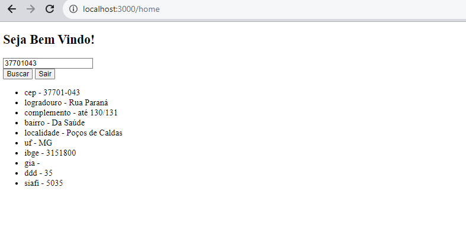

# Content and Axios

> Login page using context, which is passed down to the home page after user is logged in. The Home page has axios which hits a CEP consultand API that brings back the info of the CEP searched.

Project --> **Context and Axios** 
Channel --> **Patrick** 
Date Created --> **March 2023**

### Observations

-  create-react-app
-  create-context-react
-  react-router-dom
-  Axios is a promise-based HTTP Client
-  viaCep API
-  Private route component, renders home page if user authenticates
-  services --> api uses axios to get zipcode info

### Components

-  AppMain
   -  Home
   -  Login
   -  AuthContex
   -  PrivateRoute
   -  api
